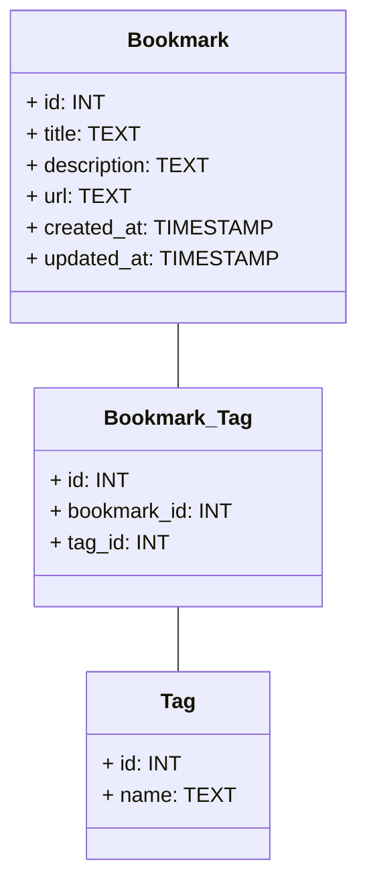

# Database design

```mermaid
classDiagram
    class Bookmark {
        + id: INT
        + title: TEXT
        + description: TEXT
        + url: TEXT
        + created_at: TIMESTAMP
        + updated_at: TIMESTAMP
    }

    class Tag {
        + id: INT
        + name: TEXT
    }

    class Bookmark_Tag {
        + id: INT
        + bookmark_id: INT
        + tag_id: INT
    }

    Bookmark -- Bookmark_Tag
    Bookmark_Tag -- Tag
```
